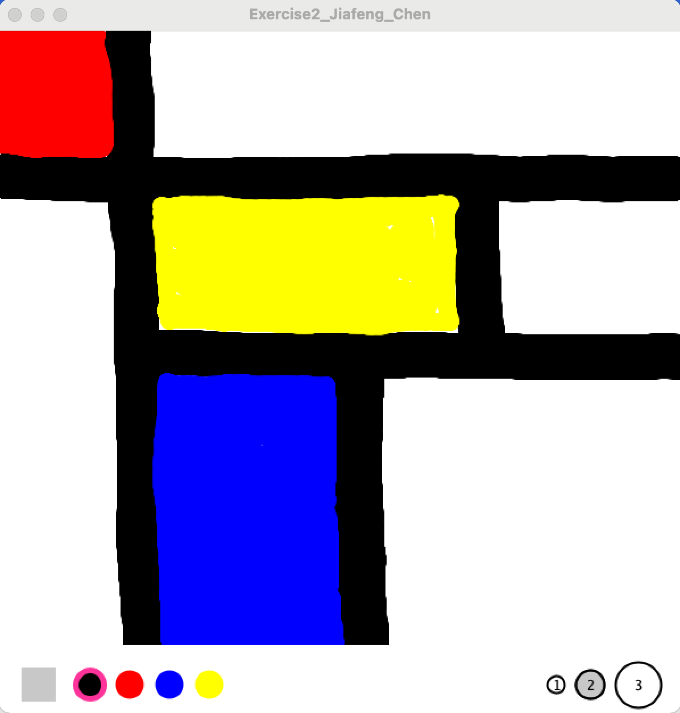
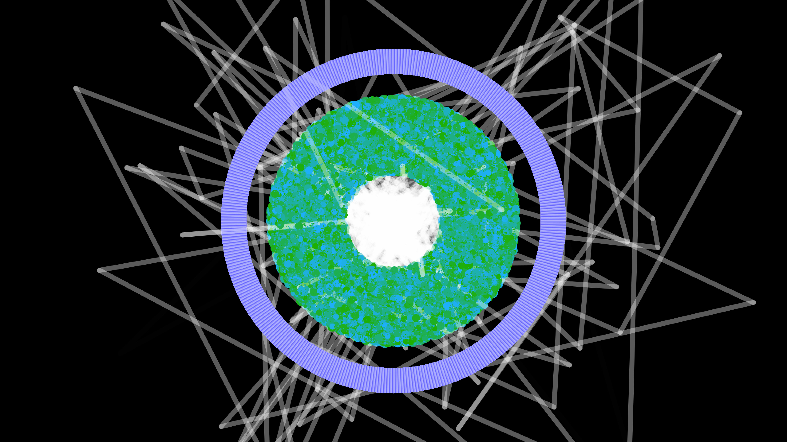
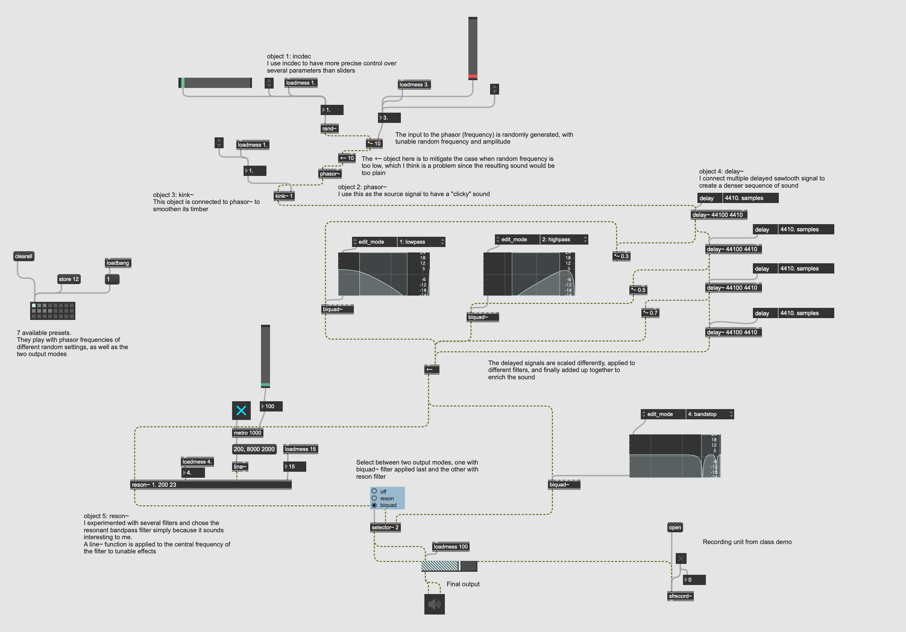
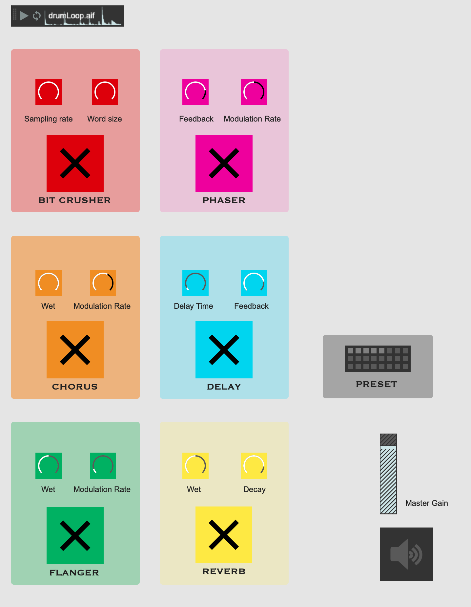
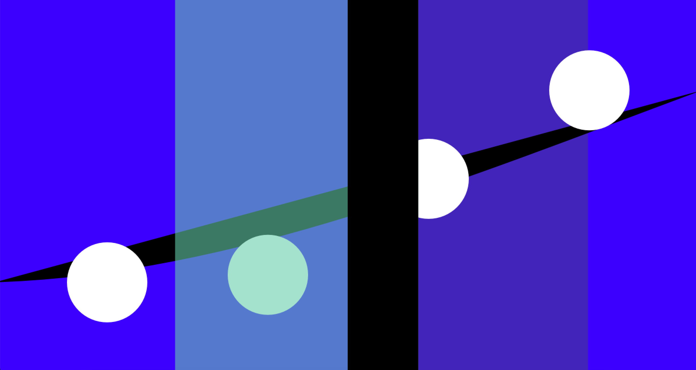
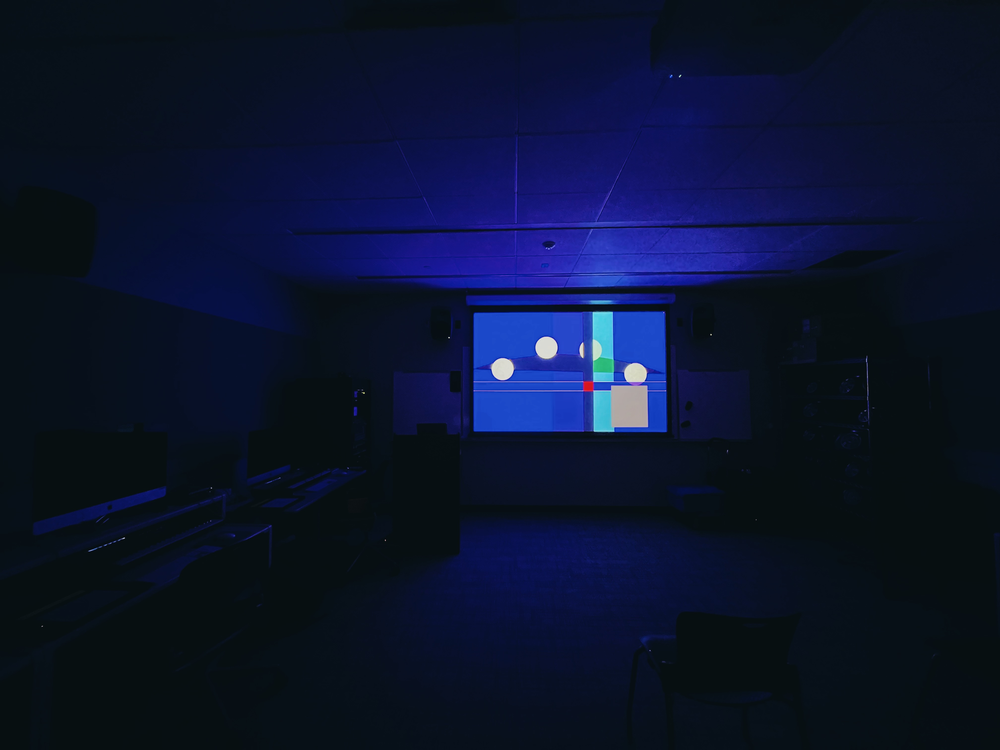

# PAT 204 Coding Projects

This is a repo for my PAT 204, Creative Coding for Music, course projects.

### Project List:

#### Processing

* **HW1**: Haiku composition

* **HW2**: Sketch board

* **HW3**: 2D interactive visual

* **HW4**: 3D interactive visual

* **Midterm Project**: Music visualizer

### Max

**HW6**: Synthesizer

**HW7**: Drum Machine

**HW8**: Granular Synthesizer

**HW9**: Effect Pedalboard

### Max + Processing

**HW10**: Visualized Arpeggiator

**HW11**: Audiovisual Generative Art

**Final Project**: WAVE / FORM (Audiovisual Installation)

Demo video: https://vimeo.com/752048616

