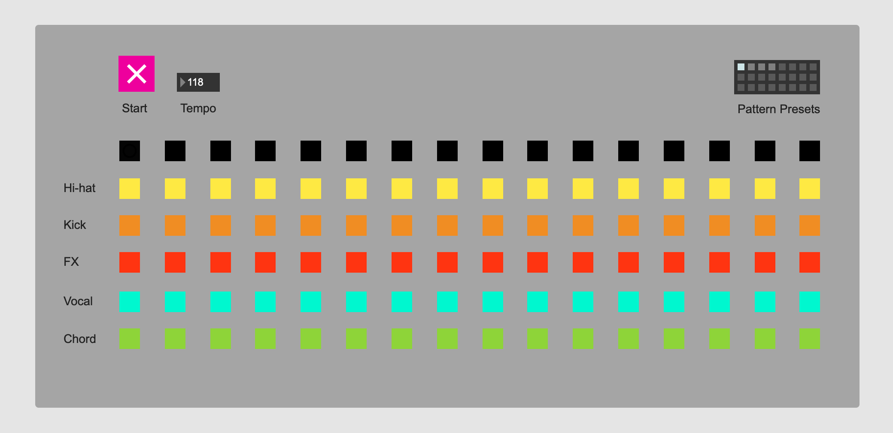
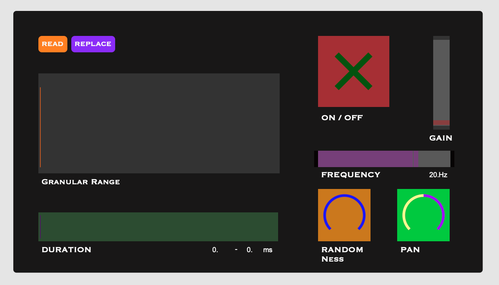

# PAT 204 Coding Projects

This is a repo for my PAT 204, Creative Coding for Music, course projects.

### Project List:

#### Processing

* **HW1**: Haiku composition

* **HW2**: Sketch board

* **HW3**: 2D interactive visual

* **HW4**: 3D interactive visual

* **Midterm Project**: Music visualizer

**HW6**: Synthesizer

**HW7**: Drum Machine

**HW8**: Granular Synthesizer

**HW9**: Effect Pedalboard

